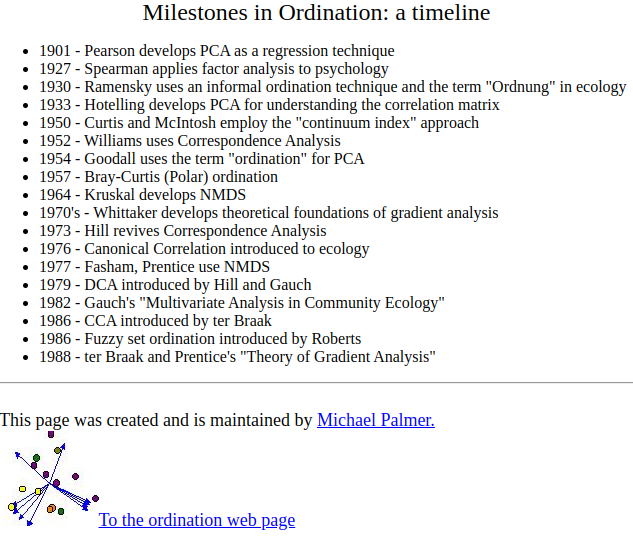
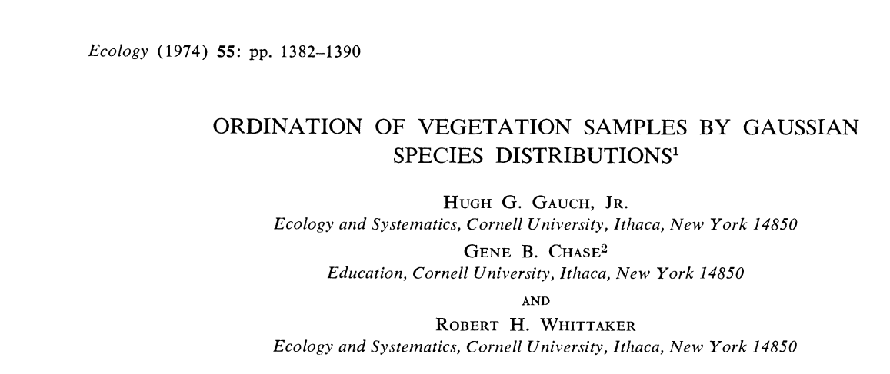
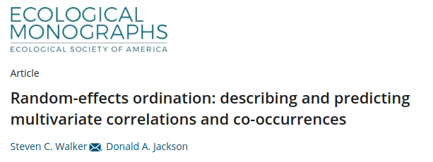
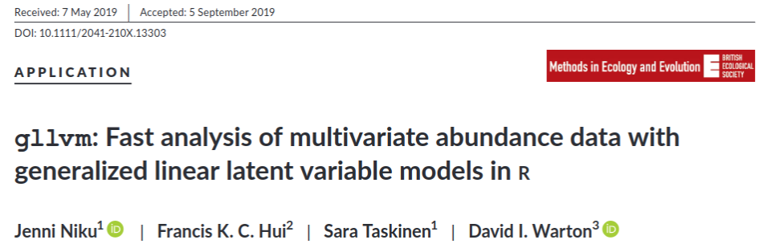

```{r setup, include=FALSE}
library(knitr)

opts_chunk$set(
    warning = FALSE,
    message=FALSE,
    echo=FALSE
)

default_source_hook <- knit_hooks$get('source')
default_output_hook <- knit_hooks$get('output')

knit_hooks$set(
  source = function(x, options) {
    paste0(
      "\n::: {.codebox data-latex=\"\"}\n\n",
      default_source_hook(x, options),
      "\n\n:::\n\n")
  }
)

knit_hooks$set(
  output = function(x, options) {
    paste0(
      "\n::: {.codebox data-latex=\"\"}\n\n",
      default_output_hook(x, options),
      "\n\n:::\n\n")
  }
)
```

# Outline

 \textbf{Part I}: Background \newline
 \textbf{Part II}: "Model-based" ordination \newline
 \textbf{Part III}: Getting the methods to the people \newline
 \textbf{Part IV}: Big picture stuff \newline

\tcbox[tikznode, enhanced,boxrule=0pt,colback=red!50,interior style={opacity=1},frame style={opacity=1},nobeforeafter,tcbox raise base,shrink tight,extrude by=5mm, left=1mm, width = \paperwidth,overlay]{I will try to convince you that community ecology needs these methods.}

\vspace*{1cm}

Slides: https://github.com/BertvanderVeen/VOC-talk

 <!--vision/goal-->

<!-- # Outline -->

<!-- 1) Community ecology (background and "establishedness") - 10 min -->
<!--   - background stuff until status quo in 90s, note i wasnt around -->
<!-- 2) "Model-based" ordination- 15 min -->
<!--   - full rank reference model with everything ontop and included -->
<!--   - unconstrained ordination was introduced by others..but works like this -->
<!--   - my work and developments: quadratic, concurrent, phylogenetic, minic, i want to go towards hierarchical ordination: turning it into a full fledged framework (maybe even show HO figure) -->
<!--   - technical challenges: minic, double RE hierarc -->
<!-- 3) The gllvm software package - 10 min -->
<!--   - gllvm 2.0: flexible and fast hierarchical modeling of community data -->
<!--   - what can it do (families and such), functionality with new formula interfaces, maybe an example -->
<!--   - what comes next: hierarhical ordination, maybe via regularization? not sure anymore.. improved inference? better technicalities such as convergence? workshops, spreading the word..mixed response types, spatial stuff pekka,  -->
<!-- 4) Big picture stuff - 5 minutes:  -->
<!--   - We have these great methods -->
<!--   - Implemented in software -->
<!--   - There are still technical challenges. Optimisation and starting values. Approximation techniques are too inflexible. More model development. We need to get people to use the methods. now -->

<!-- \textbf{For each part write a main messag eI will try to convey} -->
<!-- Part I: status quo -->

<!-- Slides are here at this github repo.. -->

# Part I

## {.plain}

\begin{tikzpicture}[remember picture, overlay]
    \fill[NTNUBlue] (current page.south west) rectangle (current page.north east);
\end{tikzpicture}
\vbox to \textheight{ % Flexible box to fill vertical space
        \vskip 0pt plus 1fill % Add flexible space before the title
        \centering
        \Large \textcolor{grey}{\textbf{Part I}} % Title at the top
        \vskip 0pt plus 0.5fill % Add flexible space between title and subtitle
        \huge \textcolor{white}{\textbf{Background}} % Subtitle in the middle
        \vskip 0pt plus 1fill % Add flexible space before the content (or footer if needed)
}


\addtocounter{framenumber}{-1}


## Community ecology

```{r image, echo=F,eval=TRUE,out.width="65%",out.height="65%", fig.align="center"}

```

## Gathering data

\begin{center}
Go out, register species at multiple sites
\end{center}

\alt<2>{

```{r, out.width = "60%", fig.cap="Geir-Harald Strand / NIBIO", fig.align="center"} 
knitr::include_graphics("images/heath_picture_sites.png")
```


}{

```{r, out.width = "60%", fig.cap="Geir-Harald Strand / NIBIO", fig.align="center"} 

```

}

<!-- ## Why ordination -->

<!-- - A single analysis for all data (historical argument) -->
<!-- - Make a pretty picture -->
<!-- - Summarize data -->
<!-- - To expose an underlying process -->

<!-- \begin{center} -->

<!-- \textbf{To reduce parameters of full-rank analysis with sparse data} -->

<!-- \end{center} -->

## Goal: analysis of sparse data

- Species occur at few places
- Shelford's law of tolerance (1931)
- Specialist and generalist species

```{r, fig.align="center", fig.width=13}
makeTransparent<-function(someColor, alpha=100)
{
  newColor<-col2rgb(someColor)
  apply(newColor, 2, function(curcoldata){rgb(red=curcoldata[1], green=curcoldata[2],
    blue=curcoldata[3],alpha=alpha, maxColorValue=255)})
}

# https://stats.stackexchange.com/questions/12209/percentage-of-overlapping-regions-of-two-normal-distributions
min.f1f2 <- function(x, mu1, mu2, sd1, sd2) {
    f1 <- dnorm(x, mean=mu1, sd=sd1)
    f2 <- dnorm(x, mean=mu2, sd=sd2)
    pmin(f1, f2)
}

mu1 <- -2;    sd1 <- 2
mu2 <- 1;    sd2 <- 1

xs <- seq(min(mu1 - 4*sd1), max(mu1 + 4*sd1), .001)
f1 <- dnorm(xs, mean=mu1, sd=sd1)

par(mar=c(5, 5, 4, 2) + 0.1)
plot(xs, f1, type="n", ylim=c(0, max(f1)+0.01), col="blue",yaxs="i",yaxt="n",xaxt="n",xlab="Latent dimension", ylab="Abundance", cex.lab=1.8,cex.axis=1.8)

# abline(v=mu1-4*sd1, col="red", lty="dashed")
# abline(v=mu1+4*sd1, col="red", lty="dashed")
# 
# abline(v=mu1-3*sd1, col="orange", lty="dashed", )
# abline(v=mu1+3*sd1, col="orange", lty="dashed")
# 
# abline(v=mu1-2*sd1, col="green", lty="dashed")
# abline(v=mu1+2*sd1, col="green", lty="dashed")
text("Good",cex=1.8, x=mu1,y=0.1)
text("Worse",cex=1.8, x=mean(c(mu1-3*sd1,mu1-2*sd1)),y=0.1)
text("Bad",cex=1.8, x=mean(c(mu1-3.7*sd1,mu1-3.7*sd1)),y=0.1)

rect(1e-3,0.3-0.001, xleft=mu1-2*sd1,xright=mu1+2*sd1,col=makeTransparent("green",40),border=makeTransparent("green",40))
rect(1e-3,0.3-0.001, xleft=mu1-3*sd1,xright=mu1-2*sd1,col=makeTransparent("orange",40),border=makeTransparent("orange",40))
rect(1e-3,0.3-0.001, xleft=mu1+3*sd1,xright=mu1+2*sd1,col=makeTransparent("orange",40),border=makeTransparent("orange",40))
rect(1e-3,0.3-0.001, xleft=mu1-4*sd1-1,xright=mu1-3*sd1,col=makeTransparent("red",40),border=makeTransparent("red",40))
rect(1e-3,0.3-0.001, xleft=mu1+4*sd1+1,xright=mu1+3*sd1,col=makeTransparent("red",40),border=makeTransparent("red",40))
lines(xs,f1,col="blue",lwd=2)

arrows(y0=0.12,x0=mu1,x1=mu1-sd1,code = 3,col="black",length=0.2)
text(mu1-sd1/2,0.13,expression("t"[1]),cex=1.8,col="black")
segments(x0=mu1,x1=mu1,y0 = 0,y1=0.2,lty="dashed",col="black")

invisible(Map(axis, side=1,at=mu1, col.axis="black", labels=expression("u"[1]), lwd=0, cex.axis=1.8))

```


## A brief history of ordination

\begin{columns}
\column{0.5\textwidth}

```{r,out.width="80%",out.height="99%", fig.align="center", echo=F}

```

\column{0.5\textwidth}

```{r,out.width="80%",out.height="99%", fig.align="center", echo=F}

```

\end{columns}

- inspired by Michael Palmer's and John Birk's
- But those are outdated (like many resources)


## 

```{r timeline1, fig.width=60, fig.height = 50, dev = "png", fig.show="hide"}
#see https://stackoverflow.com/questions/7492274/draw-a-chronological-timeline-with-ggplot2
library(ggplot2)
library(dplyr)
library(cowplot)
library(tibble)
library(ggalt)
library(lubridate)

#Create data to plot
data <- tribble( ~start_date, ~event, ~displ,
                ymd("1901-01-01"), "PCA", 0.3,
                ymd("1904-01-01"), "FA", 0.1,
                ymd("1935-01-01"), "CA", 0.6,
                ymd("1936-01-01"), "LDA", 0.1,
                ymd("1936-01-01"), "COR", 0.3,
                ymd("1951-01-01"), "RRR", 0.5,
                ymd("1954-01-01"), "'Ordination'", -0.7,
                ymd("1954-01-01"), "'Gaussian' curve", -0.1,
                ymd("1957-01-01"), "PO", 0.2,
                ymd("1964-01-01"), "RDA", 0.5,
                ymd("1964-01-01"), "NMDS", 0.1,
                ymd("1966-01-01"), "PCoA", 0.3,
                ymd("1970-01-01"), "Whittaker's Gradient analysis", -0.5,
                ymd("1971-01-01"), "Biplot", -0.6,
                ymd("1972-01-01"), "GLM", -0.3,
                ymd("1973-01-01"), "RA", -0.2,
                ymd("1974-01-01"), "GO", 0.6,
                ymd("1979-01-01"), "DCA", 0.5,
                ymd("1979-01-01"), "TWINSPAN", -0.7,
                ymd("1985-01-01"), "CA unimodal model", -0.6,
                ymd("1986-01-01"), "Canoco", -0.3,
                ymd("1986-01-01"), "CCA", 0.3,
                ymd("1987-01-01"), "Minchin NMDS \n evaluation", -0.4,
                ymd("1988-01-01"), "Theory of \n gradient analysis", -0.2,
                ymd("1999-01-01"), "PRC", 0.2,
                ymd("1999-01-01"), "db-RDA", 0.5,
                ymd("2001-01-01"), "vegan", -0.2)
col=ifelse(data$displ>0,"white","transparent")
data$displ=data$displ*100
# data[data$displ>0,"displ"]<-sort(data[data$displ>0,]$displ,decreasing = F)#its about incremental improvement
                #ymd("2001-01-01"), "R vegan", -0.5)
#add Yee, Hui, JSDM, VGAM, MGLM, GLLVM, Copula, etc, DCA, NMDS, RDA, PCoA, PRC, add a break for where usual stops, UMAP, t-SNE, 

#Function to shift x-axis to 0 adapted from link shown above

shift_axis <- function(p, xmin, xmax, y=0){
      g <- ggplotGrob(p)
      dummy <- data.frame(y=y)
      ax <- g[["grobs"]][g$layout$name == "axis-b"][[1]]
      p + annotation_custom(grid::grobTree(ax, vp = grid::viewport(y=1, height=sum(ax$height))), 
                            ymax=y, ymin=y) +
        annotate("segment", y = 0, yend = 0, x = xmin, xend = xmax) +
        theme(axis.text.x = element_blank(), 
              axis.ticks.x=element_blank())

    }


#Conditionally set whether text will be above or below the point
vjust = ifelse(data$displ > 0, -1, 1.5)

#plot
p1 <- data %>% 
  ggplot(aes(start_date, displ)) + theme_classic()+
  geom_lollipop(point.size = 30, shape = 17, col = col, size = 2) +
  geom_text(aes(x = start_date, y = displ, label = event), col = col, data = data,
            hjust = 0, vjust = vjust, size = 50) +
  theme(axis.title = element_blank(),
        axis.text.y = element_blank(),
        axis.ticks.y = element_blank(),
        axis.line = element_blank(),
        axis.text.x = element_text(size = 120)) +
  expand_limits(x = c(ymd("1900-01-01"), ymd("2020-01-01"))) +
  scale_x_date(breaks = ymd(paste0(seq(1900, 2020, 10), "-01-01")), labels = c(1900,seq(10,90,10),"00",10,2020))+ylim(c(min(data$displ)-10,max(data$displ)+10))

#and run the function from above
timeline <- shift_axis(p1, ymd("1900-01-01"), ymd("2020-01-01"))
timeline$layers[[2]]$aes_params$fontface <- timeline$layers[[1]]$aes_params$fontface <- rep("plain", length(timeline$layers[[1]]$aes_params$colour))

# use to permanently change color of entries
set_col <- function(obj,idx,col.new, fontface.new){
obj$layers[[2]]$aes_params$colour[idx]<-col.new
obj$layers[[1]]$aes_params$colour[idx]<-col.new

obj$layers[[1]]$aes_params$fontface[idx] <- fontface.new
obj$layers[[2]]$aes_params$fontface[idx] <- fontface.new
obj<-obj+coord_cartesian(clip="off")+theme(plot.margin=margin(0,6,0,0,"cm"))
return(obj)
}
set_col(timeline,1:2,"black","plain")
```

```{r timeline2, fig.width=60, fig.height = 50, dev="png", fig.show="hide"}
set_col(timeline,3:5,"black", "plain")
```

```{r timeline3, fig.width=60, fig.height = 50, dev="png", fig.show="hide"}
set_col(timeline,6,"black", "plain")
```

```{r timeline4, fig.width=60, fig.height = 50, dev="png", fig.show="hide"}
timeline <- set_col(timeline,7:8,"red", "bold")
set_col(timeline,9,"black", "plain")
timeline<-set_col(timeline,7:8,"grey", "plain")
```

\vfill

\includegraphics<1>{VOC_files/figure-beamer/timeline1-1.png}
\includegraphics<2>{VOC_files/figure-beamer/timeline2-1.png}
\includegraphics<3>{VOC_files/figure-beamer/timeline3-1.png}
\includegraphics<4>{VOC_files/figure-beamer/timeline4-1.png}

\vfill

\frametitle<1>{In the beginning, there were PCA and FA}
\frametitle<2>{Then, CA was developed}
\frametitle<3>{Next, reduced rank regression}
\frametitle<4>{Then, there was "Ordination"}


## Whittaker 1956: Unimodal responses

```{r whit,out.width="60%",out.height="60%", fig.align="center", echo=F}
knitr::include_graphics("images/Whittaker_1956_quadratic.png")
```

## 

```{r timeline5, fig.width=60, fig.height = 50, dev="png", fig.show="hide"}
timeline <- set_col(timeline,10:12,"black", "plain")
set_col(timeline,13:15,"red", "bold")
timeline <- set_col(timeline,13:15,"grey", "plain")
```

```{r timeline6, fig.width=60, fig.height = 50, dev="png", fig.show="hide"}
timeline <- set_col(timeline,c(16,19:21),"red", "bold")
set_col(timeline,c(17:18,22),"black", "plain")
timeline <- set_col(timeline,c(16,19:21),"grey", "plain")
```

\vfill

\includegraphics<1>{VOC_files/figure-beamer/timeline5-1.png}
\includegraphics<2>{VOC_files/figure-beamer/timeline6-1.png}

\vfill

\frametitle<1>{Ordination became popular}
\frametitle<2>{Rise of the unimodal model}

## Unimodal model (1)

```{r,out.width="70%",out.height="70%", fig.align="center", echo=F}

```

- Only for a single axis
- Not much use in practice
- Was "computationally intensive"

## Unimodal model (2)

```{r,out.width="70%",out.height="70%", fig.align="center", echo=F}
knitr::include_graphics("images/terBraak_1985.png")
```

 - Part of the school of latent variable models
 - Pitched CA approximately implementing a quadratic model

## NMDS as alternative to the unimodal model

```{r timeline7, fig.width=60, fig.height = 50}
set_col(timeline,23,"red", "bold")
timeline<-set_col(timeline,23,"grey", "plain")
```

## Are species response curves really symmetric?

```{r,out.width="70%",out.height="70%", fig.align="center", echo=F}
knitr::include_graphics("images/Minchin_1987.png")
```

- A skewed response model might be more realistic
- NMDS is "robust"
- Moving away from process-based thinking

## Results Minchin dataset

```{r, echo=F, message=F, warning=F, fig.show="hold"}
library(vegan)
library(gllvm)
# Download the minchin dataset
minchin <- read.csv("../data/Minchin87_2b_counts.csv") # Data frmo minchin 1987
# All missing values are zeros
minchin[is.na(minchin)] <- 0
minchin<-minchin[,-1]
# We will first do some classical ordination methods
# Correspondence analysis
CA_minchin <- cca(minchin)
# Detrended CA
DCA_minchin <- decorana(minchin)
logDCA_minchin <- decorana(log1p(minchin))

# NMDS
NMDS_minchin <- metaMDS(minchin, k = 2, trace = F)
par(mfrow=c(2,2))
# Let's have a look at the results
plot(scores(CA_minchin,display="sites"), main="CA") # arch effect
plot(scores(DCA_minchin)[,1:2], main="DCA") # This has the tongue effect
plot(scores(logDCA_minchin, display="sites"), main="log-DCA c.q. ter Braak and Smilauer (2015) ") # suggestion from paper CTB
plot(NMDS_minchin$points, main="NMDS") # This looks pretty OK!
```

## 

```{r timeline8, fig.width=60, fig.height = 50, dev="png", fig.show="hide"}
set_col(timeline,24,"red", "bold")
timeline<-set_col(timeline,24, "gray", "plain")
```

```{r timeline9, fig.width=60, fig.height = 50, dev = "png", fig.show="hide"}
timeline <- set_col(timeline,25:26,"black", "plain")
set_col(timeline,27,"red", "bold")
timeline <- set_col(timeline,27,"gray", "plain")
```

```{r timeline10, fig.width=60, fig.height = 50, dev="png", fig.show="hide"}
timeline$layers[[1]]$aes_params$colour[timeline$data$event%in%c("PCA","RDA","CCA","CA","DCA","CCA","NMDS","db-RDA","PCoA")] <- "red"
timeline$layers[[2]]$aes_params$colour[timeline$data$event%in%c("PCA","RDA","CCA","CA","DCA","CCA","NMDS","db-RDA","PCoA")] <- "red"
timeline$layers[[1]]$aes_params$fontface[timeline$data$event%in%c("PCA","RDA","CCA","CA","DCA","CCA","NMDS","db-RDA","PCoA")] <- "bold"
timeline$layers[[1]]$aes_params$fontface[timeline$data$event%in%c("PCA","RDA","CCA","CA","DCA","CCA","NMDS","db-RDA","PCoA")] <- "bold"
timeline
```

\vfill

\includegraphics<1>{VOC_files/figure-beamer/timeline8-1.png}
\includegraphics<2>{VOC_files/figure-beamer/timeline9-1.png}
<!-- \includegraphics<3>{VOC_files/figure-beamer/timeline10-1.png} -->

\vfill

\frametitle<1>{A theory for gradient analysis}
\frametitle<2>{\texttt{vegan}}
<!-- \frametitle<3>{The most popular methods to date} -->

## Ordination methods are well-established

- One of the successes currently: so many resources!
  - vegan, anadat, labdsv
  - many books, websites (Michael Palmer, David Zeleney)
  - run a search and you will find the answer
- This is where most courses stop
  - Contemporary ordination methods are not taught
  - E.g., in machine learning (t-SNE, UMAP and such)
  - But also model-based ordination methods are not taught

## Ordinations methods in status quo

\begin{center}
\textbf{There is now little discussion in ecology about ordination}
\end{center}
\pause

\begin{enumerate}
\item Application follows a standard narrative \tiny ter Braak and Prentice (1988) \normalsize \pause
\item NMDS when that does not work \pause
\item Contemporary developments are limitedly adopted \pause
\item Little discussion about performance or preference of methods \pause
\item Ordination methods are now \textit{descriptive}
\begin{itemize}
\item One upon a time, ordination \textbf{was} the push for more quantitative methods
\end{itemize}
\end{enumerate}

## The issue? Attitude.

\begin{enumerate}
\item Ordination methods are descriptive and uncool
\item Complex methods are thought not \textit{robust}
\item The methods are not understandable \newline (because \textit{linear regression} is hard to understand)
\end{enumerate}

<!--robust: because poor historical methods arent..-->


## Low-dimensional analysis

The narrative has changed: the right visualization is "cooler" than the left (despite the same underlaying model)

\begin{columns}
\column{0.5\textwidth}

```{r echo=F, out.width="99%", fig.align="center", fig.cap="ordination of spider data"}
library(gllvm)
data(spider, package = "mvabund")
model <- gllvm(spider$abund, num.lv = 2, family = "negative.binomial", row.eff = "random")
gllvm::ordiplot(model, symbols = TRUE, cex.main = 2, cex.axis = 2, cex.lab = 1.5, biplot = TRUE, s.cex = 2, cex.spp = 2)
```

\column{0.5\textwidth}

```{r echo=F, out.width="99%", fig.align="center", fig.cap="correlations of spider data", fig.show="hold", cache = TRUE, dpi = 300}
corrplot::corrplot(getResidualCor(model),type = "lower",order = "AOE", tl.cex = 1.5, cl.cex = 1.5)
```

\end{columns}

## \footnotesize We are working on telling people these are the same..


## Correlation and interaction


# Part II

## {.plain}

\begin{tikzpicture}[remember picture, overlay]
    \fill[NTNUBlue] (current page.south west) rectangle (current page.north east);
\end{tikzpicture}
\vbox to \textheight{ % Flexible box to fill vertical space
        \vskip 0pt plus 1fill % Add flexible space before the title
        \centering
        \Large \textcolor{grey}{\textbf{Part II}} % Title at the top
        \vskip 0pt plus 0.5fill % Add flexible space between title and subtitle
        \huge \textcolor{white}{\textbf{"Model-based" ordination}} % Subtitle in the middle
        \vskip 0pt plus 1fill % Add flexible space before the content (or footer if needed)
}


\addtocounter{framenumber}{-1}


## Where it started

```{r, out.width="99%", out.height = "50%", fig.align="center"} 
knitr::include_graphics("images/distance-based.png")
```

```{r, out.width="99%", out.height = "50%", fig.align="center"} 
knitr::include_graphics("images/central.png")
```

<!-- ## The goal -->

<!-- \begin{center} -->
<!-- To offer ecologists a better framework for ordination -->
<!-- \end{center} -->

## Standing on the shoulder of giants

\begin{columns}
\column{0.5\textwidth}

```{r, out.width = "99%"}

```

```{r, out.width = "99%"}
knitr::include_graphics("images/modelbased.png")
```

\column{0.5\textwidth}

```{r, out.width = "99%"}

```

```{r, out.width = "99%"}
knitr::include_graphics("images/Yee.png")
```

\end{columns}


## What functionality was still needed to replace ordination

\begin{enumerate}
\item Unimodal responses
\item Constrained ordination (with random effects)
\item Additional random effects for nested designs
\item User friendliness (as much as possible)
\item Robustness c.q. Minchin (1980)
\end{enumerate}

## Generalized Linear Latent Variable Model (GLLVM)

\alt<1>{
\begin{itemize}
\item A framework for model-based multivariate analysis
\item That does dimension reduction (i.e., ordination)
\item There is no distance measure to specify
\item You do need to specify: 
\begin{enumerate}  
  \item A distribution
  \item A link function
  \item The model structure
\end{enumerate}
\item We (can) treat terms as random or fixed when appropriate
\end{itemize}  
}{
\begin{figure}
\includegraphics{images/GLLVM.jpg}
\caption{Based on, but not limited to, the class defined by Skrondal and Rabe-Heskterh (2004)}
\end{figure}
}
## Response distribution

\begin{equation}
\tikzmarknode{t1}{y_{ij}}
\sim
\tikzmarknode{t2}{\highlight{blue}{f}}
\biggl\{
\tikzmarknode{t3}{\highlight{gray}{g^{-1}}}
\biggl(
\tikzmarknode{t4}{\highlight{red}{\eta_{ij}}}
              \biggr),
\tikzmarknode{t5}{\highlight{grey}{\phi_j}}
\biggr\}
\end{equation}

\begin{enumerate}
    \item<2> Community data
        \tikz[na,remember picture]\node[coordinate] (n1) {};
    \item<3> Response distribution
        \tikz[na,remember picture]\node[coordinate] (n2) {};
    \item<4> (inverse) Link function
        \tikz[na,remember picture]\node[coordinate] (n3) {};
    \item<5> Linear predictor ("the model")
        \tikz[na,remember picture]\node[coordinate] (n4) {};
   \item<6> Dispersion parameter
        \tikz[na,remember picture]\node[coordinate] (n5) {};
\end{enumerate}


\begin{tikzpicture}[overlay,remember picture]
        \draw<2>[->] (n1) -| ([xshift=0.1cm]n1) |- ([xshift=0.1cm, yshift = 0.3cm]n1) -| (t1);
        \draw<3>[->] ([xshift=-0.5cm, yshift = 0.2cm]n2) |- ([xshift=-0.5cm, yshift = 0.3cm]n2) -| (t2);
        \draw<4>[->] (n3) -| (t3);
        \draw<5>[->] (n4) -| (t4);
        \draw<6>[->] (n5) -| (t5);
\end{tikzpicture}

## The reference model

\begin{equation}
g\{\mathbb{E}(y_{ij} \vert r_{0i},\textbf{u}_j,\epsilon_{ij})\}
=
\tikzmarknode{t1}{\highlight{red}{\eta_{ij}}}
= 
\tikzmarknode{t2}{\highlight{blue}{\beta_{0j}}}
+
\tikzmarknode{t3}{\highlight{yellow}{r_{0i}}}
+
\tikzmarknode{t4}{\highlight{orange}{\textbf{x}_i^\top\boldsymbol{\beta}_j}}
+
\tikzmarknode{t5}{\highlight{gray}{\textbf{z}_i^\top\textbf{u}_j}}
+
\tikzmarknode{t6}{\highlight{green}{\epsilon_{ij}}}
\end{equation}

\only<2-7>{
\begin{enumerate}
    \item<2> \tikzmarknode{n1}{Linear predictor}
    \item<3> \tikzmarknode{n2}{Species (column) intercept}
    \item<4> Sample (row) intercept
        \tikz[na,remember picture]\node[coordinate] (n3) {};
    \item<5> Fixed effects
        \tikz[na,remember picture]\node[coordinate] (n4) {};
    \item<6> Random effects
        \tikz[na,remember picture]\node[coordinate] (n5) {};
    \item<7> Residual error incorporating between-column correlation
        \tikz[na,remember picture]\node[coordinate] (n6) {};
\end{enumerate}

\begin{tikzpicture}[overlay,remember picture]
        \draw<2>[->] ([xshift=-0.5cm]n1.west) -- ([xshift=-0.7cm]n1.west) -| ([xshift=-0.7cm]n1.north west) |- (t1.west);
        \draw<3>[->]  ([xshift=-0.5cm]n2.west) -- ([xshift=-0.7cm]n2.west) -| ([xshift=-0.7cm]n2.north west) |- ([yshift=-0.7cm]t2.south) -- (t2.south);
        \draw<4>[->] (n3) -| (t3);
        \draw<5>[->] (n4) -| (t4);
        \draw<6>[->] (n5) -| (t5);
        \draw<7>[->] (n6.east) -- ([xshift=0.7cm]n6.east) |- (t6.east);
\end{tikzpicture}
}

\only<8->{
\begin{equation}
\mathcal{L}(\Theta) = \log\biggl\{ \displaystyle\int f\biggl(\textbf{Y} \vert \highlight{green}{\boldsymbol{\epsilon}}, \highlight{gray}{\textbf{u}},\highlight{yellow}{\textbf{r}_0}\biggr)h\biggl(\boldsymbol{\epsilon},\textbf{u},\textbf{r}_0;\boldsymbol{\Sigma}_\epsilon,\boldsymbol{\Sigma}_u,\boldsymbol{\Sigma}_{r_0}\biggr)\biggr\} \partial(\boldsymbol{\epsilon},\textbf{u},\textbf{r}_0)
\label{gllvm}
\end{equation}
}

\only<9>{
\begin{tikzpicture}[inbox/.style = {rectangle, draw,
                 minimum height=12mm, minimum width=0mm, text width = 7mm,
                 align=center},
                 inbox2/.style = {rectangle, draw, align=center,minimum height=18mm, minimum width=32mm},
                 overlay,remember picture
                 ]
\node (inner0) [inbox2, fill = red!30, double=red, double distance=1.5pt, text width=200] at (current page.center){
\textbf{Requires fast methods for integration}
};      
\end{tikzpicture}
}

\only<10->{
\begin{columns}
\column{0.5\textwidth}
```{r out.width="40%",fig.align="center",fig.cap="Variational Approximations \\tiny borealisai.com"} 

```

\column{0.5\textwidth}
```{r out.width="60%",fig.align="center",fig.cap="Laplace approximation \\tiny wiljohn.top"} 

```
\end{columns}
}

\only<11>{
\begin{tikzpicture}[inbox/.style = {rectangle, draw,
                 minimum height=12mm, minimum width=0mm, text width = 7mm,
                 align=center},
                 inbox2/.style = {rectangle, draw, align=center,minimum height=18mm, minimum width=32mm},
                 overlay,remember picture
                 ]
\node (inner01) [inbox2, fill = red!30, double=red, double distance=1.5pt, text width=120] at (current page.center){
\textbf{Usually, we cannot fit this}
};      
\end{tikzpicture}
}

## Reduced-rank modeling

\begin{center}
Instead of reducing the data, \newline
\textbf{we reduce the model to a low-dimensional form} \newline
So that we need to estimate fewer parameters, and can fit faster
\end{center}

## Generalized Linear (Mixed-effects) Models {.t}

\begin{equation}
\highlight{red}{\symbf{\eta}} = 
\tikzmarknode{t3}{\highlight{blue}{\symbf{1}\symbf{\beta}^\top}}
+
\ldots
+ 
\alt<1-4>{
\alt<2->{
\tikzmarknode{t4}{\highlight{green}{\symbf{E}, \qquad \symbf{\epsilon}_i \sim \mathcal{N}(\textbf{0},
\tikzmarknode[rectangle,dashed,draw]{t4}{\highlight{green}{\symbf{\Gamma}\symbf{\Gamma}^\top}}}}
}{
\tikzmarknode{t4}{\highlight{green}{\symbf{E}, \qquad \symbf{\epsilon}_i \sim \mathcal{N}(\textbf{0},\symbf{\Sigma})}}
}
}{
\tikzmarknode[rectangle,dashed,draw]{t4}{\highlight{green}{\symbf{\Lambda}\symbf{\Gamma}^\top}}, \qquad \symbf{\lambda}_i \sim \mathcal{N}(\textbf{0},\textbf{I})
}
\end{equation}
\alt<1>{
\hfill \footnotesize This is a GLMM \normalsize
\only<1>{
\vspace*{1cm}
 \footnotesize \tikzmarknode{nu}{Induces between-column correlation} 

\begin{tikzpicture}[overlay,remember picture]
        \draw[->] (nu) -| ([xshift = -1cm]t4.south);
\end{tikzpicture}

}
}{
\hfill \footnotesize This is an unconstrained ordination \normalsize \newline
}
\uncover<3->{
\begin{equation}
\highlight{red}{\symbf{\eta}} = 
\tikzmarknode{t3}{\highlight{blue}{\symbf{1}\symbf{\beta}^\top}}
+
\ldots
+
\alt<4->{
\alt<5->{
\tikzmarknode[rectangle,draw,dashed]{t4}{\highlight{orange}{\symbf{\Lambda}\symbf{\Gamma}^\top}}
}{
\tikzmarknode[rectangle,draw,dashed]{t5}{\highlight{orange}{\symbf{X}\symbf{B}_{lv}\symbf{\Gamma}^\top}}
}
}{
\tikzmarknode[rectangle,draw,dashed]{t5}{\highlight{orange}{\symbf{X}\symbf{B}}}
}
\end{equation}
\alt<4->{
\hfill \footnotesize This is a constrained ordination \normalsize
}
{
\hfill \footnotesize This is a GLM \normalsize
}
}

\only<6>{We could apply a decomposition \textit{post-hoc}, 
\newline but the idea is to do it \textit{a-priori} and truncate it 
\newline \textit{Uniquess} needs to be safeguarded with \textbf{constraints}
}
## A unifying framework for ordination

\vfill 

```{r, out.width = "99%", out.height="50%"}

```

\vfill 

## Concurrent ordination {.t}

\begin{equation}
\tikzmarknode{t1}{\highlight{red}{\symbf{\eta}}}
= 
\tikzmarknode{t3}{\highlight{blue}{\symbf{1}\symbf{\beta}^\top}}
+
\ldots
+
\tikzmarknode[rectangle,draw,dashed]{t3}{\highlight{green}{\symbf{\Lambda}}}
\tikzmarknode{t4}{\highlight{green}{\symbf{\Gamma}^\top}}
\end{equation}

The model is flexible, $\tikzmarknode{n1}{\symbf{\Lambda}}$ can be all kinds of things.

\begin{tikzpicture}[overlay,remember picture]
        \draw[->] (t3) |- ([yshift = 0.5cm]n1.north) -- (n1);
        \draw<3->[->] (n1) |- ([xshift = -0.8cm]n2.north west) |- ([xshift = -0.5cm]n2.west);
        \draw<4->[->] ([xshift = -0.8cm]n2.north west) |- ([xshift = -0.5cm]n3.west);
        \draw<5->[->] ([xshift = -0.8cm]n3.north west) |- ([xshift = -0.5cm]n4.west);
\end{tikzpicture}

\begin{enumerate}
\item<3-> $\tikzmarknode[rectangle,draw,dashed]{n2}{\highlight{green}{\symbf{\Lambda}}} = \textbf{E},$ \textbf{unconstrained}
\item<4-> $\tikzmarknode[rectangle,draw,dashed]{n3}{\highlight{green}{\symbf{\Lambda}}} = \textbf{X}\textbf{B},$ \textbf{constrained}
\item<5-> $\tikzmarknode[rectangle,draw,dashed]{n4}{\highlight{green}{\symbf{\Lambda}}} = \textbf{X}\textbf{B} + \textbf{E},$ \underline{\textbf{concurrent}}
\end{enumerate}

\only<6>{
\begin{tikzpicture}[inbox/.style = {rectangle, draw,
                 minimum height=12mm, minimum width=0mm, text width = 7mm,
                 align=center},
                 inbox2/.style = {rectangle, draw, align=center,minimum height=18mm, minimum width=32mm},
                 overlay,remember picture
                 ]
\node (inner0) [inbox2, fill = red!30, double=red, double distance=1.5pt, text width=250] at (current page.center){
\textbf{i.e., we have a (hierarchical) Linear Mixed-effects model for the latent variables}
};      
\end{tikzpicture}
}

## Unimodal responses {.t}

\begin{columns}
\column{0.5\textwidth}

\textbf{Vanilla GLLVM}

\begin{equation}
\highlight{red}{\eta_{ij}} = \highlight{blue}{\beta_{0j}} + \ldots + \highlight{green}{\symbf{\lambda}_i^\top\symbf{\gamma}_j}
\end{equation}

\column{0.5\textwidth}

\pause

\textbf{Quadratic extension}

\begin{equation}
\highlight{red}{\eta_{ij}} = \highlight{blue}{\beta_{0j}} + \ldots + \highlight{green}{\symbf{\lambda}_i^\top\symbf{\gamma}_j - \symbf{\lambda}_i^\top\textbf{D}_j\symbf{\lambda}_i}
\end{equation}

\end{columns}

- For positive diagonal matrix of quadratic coefficients $\textbf{D}_j$
- I.e. non-linear (quadratic) in the LVs \footnotesize (van der Veen et al. 2021) \normalsize
- Similar to e.g. Correspondence Analysis \footnotesize (ter Braak 1985) \normalsize with $\text{D}_{jqq} = \text{d } \forall \text{q,j}$

\pause

\textbf{Residual covariance}

\begin{columns}
\column{0.5\textwidth}
\begin{equation}
\Sigma_{jk} = \sum \limits_{q=1}^d \gamma_{jq}\gamma_{kq} + 2\text{D}_{jqq}\text{D}_{kqq}
\end{equation}

\column{0.5\textwidth}
\begin{equation}
 = \sum \limits_{q=1}^d (\text{t}_{jq}^2\text{t}_{kq}^2)^{-1} + (0.5+\text{u}_{jq}\text{u}_{kq})
\end{equation}
\end{columns}

## Robustness {.t}

```{r clasrob, echo=F, message=F, warning=F, fig.show="hide", cache = TRUE, dev="png", dpi=150}
library(vegan)
# Download the minchin dataset
minchin <- read.csv("../data/Minchin87_2b_counts.csv") # Data frmo minchin 1987
# All missing values are zeros
minchin[is.na(minchin)] <- 0
minchin<-minchin[,-1]
# We will first do some classical ordination methods
# Correspondence analysis
CA_minchin <- cca(minchin)
# Detrended CA
DCA_minchin <- decorana(minchin)
logDCA_minchin <- decorana(log1p(minchin))

# NMDS
NMDS_minchin <- metaMDS(minchin, k = 2, trace = F)
par(mfrow=c(2,2))
# Let's have a look at the results
plot(scores(CA_minchin,display="sites"), main="CA") # arch effect
plot(scores(DCA_minchin)[,1:2], main="DCA") # This has the tongue effect
plot(scores(logDCA_minchin, display="sites"), main="log-DCA c.q. ter Braak and Smilauer (2015) ") # suggestion from paper CTB
plot(NMDS_minchin$points, main="NMDS") # This looks pretty OK!
```

```{r gllvmord, echo=F, message=F, warning=F, fig.show="hide", cache = TRUE, dev ="png", dpi = 150}
library(gllvm)
model <- gllvm(minchin, num.lv = 2, family = "negative.binomial", row.eff = "random", sd.errors = FALSE)
par(mfrow=c(1,1))
plot(getLV(model), xlab="LV1", ylab="LV2", cex = 1.5, cex.lab = 1.5, cex.axis = 1.5, main = "Model-based ordination")
box(lwd=1.5)
```

```{r gllvmord2, echo=F, message=F, warning=F, fig.show="hide", cache = TRUE, dev ="png", dpi = 150}
library(gllvm)
model <- gllvm(minchin, num.lv = 2, family = "negative.binomial", quadratic = TRUE, sd.errors = FALSE, starting.val="res", seed = 7186)
plot(getLV(model), xlab="LV1", ylab="LV2", cex = 1.5, cex.lab = 1.5, cex.axis = 1.5, main = "Model-based ordination (quadratic)")
box(lwd=1.5)
```

\only<1>{
\begin{center}
\begin{tikzpicture}[remember picture,overlay]
    \node[anchor=center] at (current page.center) {\includegraphics{images/Minchin_1987.png}};
\end{tikzpicture}
\end{center}
}

\only<2-3>{
\begin{center}
\begin{tikzpicture}[remember picture,overlay]
    \node[anchor=center] at (current page.center) {\includegraphics{VOC_files/figure-beamer/clasrob-1.png}};
\end{tikzpicture}
\end{center}
}

\only<3>{
\begin{tikzpicture}[remember picture, overlay]
    \fill[white,opacity=0.8] (current page.south west) rectangle (current page.north east);
\end{tikzpicture}
\begin{center}
\begin{tikzpicture}[remember picture,overlay]
    \node[anchor=center] at (current page.center) {\includegraphics[width=0.75\textwidth]{VOC_files/figure-beamer/gllvmord-1.png}};
\end{tikzpicture}
\end{center}
}

\only<4>{
\vfill
\begin{center}
\textbf{Now with quadratic model \footnotesize (van der Veen et al. 2021) \normalsize}
\end{center}
\vfill
}

\only<5>{
\begin{tikzpicture}[remember picture, overlay]
    \fill[white,opacity=0.8] (current page.south west) rectangle (current page.north east);
\end{tikzpicture}
\begin{center}
\begin{tikzpicture}[remember picture,overlay]
    \node[anchor=center] at (current page.center) {\includegraphics[width=0.75\textwidth]{VOC_files/figure-beamer/gllvmord2-1.png}};
\end{tikzpicture}
\end{center}
}

# Part III

## {.plain}

\begin{tikzpicture}[remember picture, overlay]
    \fill[NTNUBlue] (current page.south west) rectangle (current page.north east);
\end{tikzpicture}
\vbox to \textheight{ % Flexible box to fill vertical space
        \vskip 0pt plus 1fill % Add flexible space before the title
        \centering
        \Large \textcolor{grey}{\textbf{Part III}} % Title at the top
        \vskip 0pt plus 0.5fill % Add flexible space between title and subtitle
        \huge \textcolor{white}{\textbf{Getting methods to the people}} % Subtitle in the middle

\vskip 0pt plus 1fill % Add flexible space before the content (or footer if needed)
}

\addtocounter{framenumber}{-1}

## \texttt{gllvm}



- Originally published in 2019 by Niku et al. \tiny I "joined in" shortly after \normalsize
- For model-based multivariate analysis of community ecological data
- Models are fitted in C++ \tiny (Kristensen et al. 2015) \normalsize
- Estimated with general-purpose numerical optimisation

## \texttt{gllvm} 2.0

\tikz[remember picture, overlay] {\node[anchor=south east, outer sep=0pt] at (current page.south east) {\includegraphics[width=2cm]{images/no-photography-icon.png}};}
    
\begin{center}
\begin{tikzpicture}[scale=.8, every node/.style={scale=0.8}]
% Draw circles in the order of layers
\draw[fill=olive!50!green!40!white!20] (2,{-2*sqrt(3)}) circle [radius=2.7];
% Outer blue circle
\draw[fill=blue!80!darkgray!40!white!10] (0,0) circle [radius=3.4];
% Outer yellow circle
\draw[fill=yellow!10] (4,0) circle [radius=3.4];

% Inner blue circle
\draw[fill=blue!80!darkgray!40!white!20] (0,0) circle [radius=2.7];
% Inner yellow circle
\draw[fill=yellow!20] (4,0) circle [radius=2.7];

% Draw large outer circles for layering
\draw[fill=blue!80!darkgray!40!white!30] (0,0) circle [radius=2];
\draw[fill=yellow!30] (4,0) circle [radius=2];
\draw[fill=olive!50!green!40!white!40] (2,{-2*sqrt(3)}) circle [radius=2];

% Smaller circles inside the large circles with labels
\draw[fill=blue!80!darkgray!40, draw=black, ultra thick] (0,0) circle [radius=1.3] node[fill=white, ultra thick, draw=blue!80!darkgray!40!black] {Latent variables};
\draw[fill=yellow, draw=black, ultra thick] (4,0) circle [radius=1.3] node[fill=white, ultra thick, draw=yellow!60!darkgray] {Species effects};
\draw[fill=olive!50!green!40, draw=black, ultra thick] (2,{-2*sqrt(3)}) circle [radius=1.3] node[fill=white, ultra thick, draw=olive!50!green!40!black] {Community effects};

% Adding labels in the white space between the gray fill and the black border
\node at (0, 1.6) {\Large$\textbf{X}_\text{Environment}$}; % Above first circle
\node at (0, 2.3) {\Large$\boldsymbol{\epsilon}_\text{error}$}; % Above second circle
\node at (0, 3) {\Large Space/Time}; % Above second circle
\node at (4, 1.6) {\Large$\textbf{X}_\text{Environment}$}; % Above second circle
\node at (4, 2.3) {\Large$\textbf{TR}_\text{Traits}$}; % Above second circle
\node at (4, 3) {\Large$\textbf{C}_\text{Phylogeny}$}; % Above second circle
\node at (2, {-2*sqrt(3)-1.6}) {\Large $\textbf{X}_\text{Environment}$}; % Below third
\node at (2, {-2*sqrt(3)-2.3}) {\Large Space/Time}; % Below third circle

% New central circle in the middle
\draw[fill=white, draw=black, ultra thick, dashed] (2,-1.15) circle [radius=1] node {gllvm};
\end{tikzpicture}
\end{center}

\tikz[remember picture, overlay] {\node[anchor=south west, outer sep=0pt] at (current page.south west) {\footnotesize Korhonen et al. (in prep)};}


## Response distributions

Distributions for all common data types:

\small

\begin{columns}
\column{0.25\textwidth}
\textbf{Continuous}
\begin{itemize}
\item Gaussian
\item[]
\item[]
\item[]
\end{itemize}
\column{0.25\textwidth}
\textbf{Bounded}
\begin{itemize}
\item exponential
\item gamma
\item Tweedie
\item beta
\end{itemize}
\column{0.25\textwidth}
\textbf{Discrete}
\begin{itemize}
\item Poisson
\item NB\footnotemark
\item binomial
\item ordinal
\end{itemize}
\column{0.25\textwidth}
\textbf{Zero-inflated}
\begin{itemize}
\item Poisson
\item NB\footnotemark[1]
\item hurdle beta
\item ordered beta
\end{itemize}
\end{columns}

\footnotetext{negative binomial}

\normalsize

## Syntax headlines

- Main function: `gllvm(.)`
- Define the type of latent variable: `num.lv`, `num.RR`, `num.lv.c`
- Formula arguments to specify the main components: `formula`, `lv.formula`, `row.eff`
- `family` to specify the distribution

## Demonstration

Wadden sea data [Dewenter et al. (2023)](https://onlinelibrary.wiley.com/doi/full/10.1002/ece3.10815)

\begin{columns}
\column{0.5\textwidth}
\begin{itemize}
\item Abundance (counts) of macrozoobenthos
\item Covariates
\item Transects at islands (Norderney, Spiekeroog, Wangerooge)
\end{itemize}
\column{0.5\textwidth}
\begin{figure}[h]
\centering
\includegraphics{images/macrozoobenthos.jpg}
\caption{nioz.nl}
\end{figure}
\end{columns}

```{r dat, echo = -4}
Ya <- read.csv("../data/waddenY.csv")[,-c(1:2)];
Ya <- Ya[, colSums(ifelse(Ya==0,0,1))>2]
X <- read.csv("../data/waddenX.csv")
X <- X[,!apply(X,2,anyNA)]
X[,unlist(lapply(X,is.numeric))] <- scale(X[,unlist(lapply(X,is.numeric))])
```

## Unconstrained ordination

\footnotesize

```{r uord, echo = c(-1,-3,-5), out.width="49%", fig.show="hold",message=FALSE, warning=FALSE, results = FALSE, cache = TRUE, fig.height = 10}
library(gllvm)
uord1 <- gllvm(Ya, num.lv = 2, family = "poisson")
plot(uord1, which = 2, caption = "Poisson", cex = 2, cex.lab = 2, cex.axis = 2, main = NA)
uord2 <- gllvm(Ya, num.lv = 2, family = "negative.binomial")
plot(uord2, which = 2, caption = "Negative binomial", cex = 2, cex.lab = 2, cex.axis = 2, main = NA)
```

## Group-level unconstrained ordination

\footnotesize

```{r cord12, echo = c(-2, -4), out.width="49%", warning=FALSE, message=FALSE, results = FALSE, cache = TRUE, fig.show="hold"}
cord1 <- gllvm(Ya, X = X, 
              num.RR = 2, lv.formula = ~(1|island), randomB = "LV", 
              family = "negative.binomial", disp.formula = rep(1,ncol(Ya)))
gllvm::ordiplot(cord1, symbols=TRUE, pch=X$island, arrow.scale=0, s.cex = 2, cex.main = 2, cex.axis = 2, cex.lab = 2,s.colors = as.character(factor(X$island,labels  = c("blue", "green", "black"))))
cord2 <- gllvm(Ya, X = X, 
              num.RR = 2, lv.formula = ~(1|island/transect), randomB = "LV", 
              family = "negative.binomial", disp.formula = rep(1,ncol(Ya)))
gllvm::ordiplot(cord2, symbols=TRUE, pch=X$island, s.colors = as.character(factor(X$island,labels  = c("blue", "green", "black"))), arrow.scale=0, s.cex = 2, cex.main = 2, cex.axis = 2, cex.lab = 2, main = NA)
```

## Quadratic unconstrained ordination

\footnotesize

```{r cord3, echo = -2, fig.height = 5, warning=FALSE, message=FALSE, results = FALSE, fig.show="hold", cache = TRUE}
cord3 <- gllvm(Ya, X = X, quadratic = TRUE, 
              num.RR = 2, lv.formula = ~(1|island/transect), randomB = "LV", 
              family = "negative.binomial", disp.formula = rep(1,ncol(Ya)))
gllvm::ordiplot(cord3, symbols=TRUE, pch=X$island, s.colors = as.character(factor(X$island,labels  = c("blue", "green", "black"))), arrow.scale=0, cex.env = 1, main = NA)
```

## Partial (fixed effects) constrained ordination

\footnotesize

```{r cord4, echo = c(-2,-3), fig.height = 8, out.width="49%",warning=FALSE, message=FALSE, results = FALSE, fig.show="hold", cache = TRUE, seed = 1}
cord4 <- gllvm(Ya, X = X, studyDesign = X, num.RR = 2,
              lv.formula = ~ elevation + silt_clay + season + TOC, 
              row.eff = ~(1|island:transect),
              family = "negative.binomial", disp.formula = rep(1,ncol(Ya)))
gllvm::ordiplot(cord4, symbols=TRUE, pch=X$island, s.colors = as.character(factor(X$island,labels  = c("blue", "green", "black"))), cex.env = 1.5, main = NA)
coefplot(cord4, which.Xcoef = "elevation")
```

## Reduced-rank approximated effects

Since we have the relationship

\begin{equation}
\symbf{\beta} = \textbf{B}\symbf{\Gamma}^\top
\end{equation}

assuming normality and unbiasedness for both RHS quantities, we also have
\vspace*{-1cm}

\begin{equation}
\begin{aligned}
\text{var}(\hat{\textbf{b}_k}\hat{\symbf{\gamma}_j}) = &\sum \limits^d_{q=1} \sum \limits^d_{r=1} \\
&b_{kq}b_{kr}\text{cov}(\hat{\gamma_{qj}},\hat{\gamma_{rj}}) + \gamma_{rj}b_{kq}\text{cov}(\hat{\gamma}_{qj},\hat{b}_{kr})+\\ 
&\gamma_{qj}b_{kr}\text{cov}(\hat{\gamma}_{rj},\hat{b}_{kq}) + \gamma_{qj}\gamma_{rj}\text{cov}(\hat{b}_{kq},\hat{b}_{kr}) +\\
& \text{cov}(\hat{b}_{kq},\hat{b}_{kr})\text{cov}(\hat{\gamma}_{qj},\hat{\gamma}_{rj}) + \text{cov}(\hat{\gamma}_{rj}, \hat{b}_{kq})\text{cov}(\hat{\gamma}_{qj},\hat{b}_{kr})
\end{aligned}
\end{equation}


\tiny (for the quadratic model the solution is a bit more lengthy) \hfill van der Veen et al. (2023)

## Partial (random effects) constrained ordination

\footnotesize

```{r cord4b, echo = c(-2,-3,-4), fig.height = 10, out.width="49%",warning=FALSE, message=FALSE, results = FALSE, fig.show="hide", cache = TRUE, dev = "png"}
cord4b <- gllvm(Ya, X = X, studyDesign = X, num.RR = 2, randomB = "LV",
              lv.formula = ~ (0+elevation + silt_clay + season + TOC|1), 
              row.eff = ~(1|island:transect), optimizer = "nlminb",
              family = "negative.binomial", disp.formula = rep(1,ncol(Ya)))
gllvm::ordiplot(cord4b, symbols=TRUE, pch=X$island, s.colors = as.character(factor(X$island,labels  = c("blue", "green", "black"))), cex.env = 1.5, main = NA)
randomCoefplot(cord4b, which.Xcoef = "elevation")
```

\vspace*{0.1cm}

\begin{columns}
\column{0.5\textwidth}
\includegraphics{VOC_files/figure-beamer/cord4b-1.png}
\column{0.5\textwidth}
\includegraphics{VOC_files/figure-beamer/cord4b-2.png}
\end{columns}

## Partial (random effects) constrained ordination

\footnotesize 

```{r cord4c, fig.height = 6, echo = TRUE, warning=FALSE, message=FALSE, results = FALSE, cache = TRUE, dev = "png"}
corrplot::corrplot(getEnvironCor(cord4b), order = "AOE", type = "lower", tl.pos = "l", tl.cex = 0.5)
```

\addtocounter{framenumber}{-1}

## Partial (fixed effects) constrained ordination

\footnotesize

```{r cord5, echo = c(-1,-4), fig.height = 4.3, warning=FALSE, message=FALSE, results = FALSE, fig.show="hold", cache = TRUE}
par(mar=c(5,4,1,2)+0.1)
TMB::openmp(7,autopar=TRUE)
cord5 <- gllvm(Ya, X = X, studyDesign = X, num.RR = 2,
              lv.formula = ~ elevation + silt_clay + season + TOC, 
              formula = ~diag(1|island/transect), starting.val = "zero",
              family = "negative.binomial", disp.formula = rep(1,ncol(Ya)), 
              Ab.struct = "diagonal", optim.method = "L-BFGS-B")
gllvm::ordiplot(cord5, symbols=TRUE, pch=X$island, s.colors = as.character(factor(X$island,labels  = c("blue", "green", "black"))), cex.env = 1.5, main = NA)
```

## Concurrent ordination

\footnotesize

```{r cnord1, echo = c(-1,-3), fig.height = 4.3 , warning=FALSE, message=FALSE, results = FALSE, fig.show="hold", cache = TRUE}
par(mar=c(5,4,1,2)+0.1)
cnord1 <- gllvm(Ya, X = X, studyDesign = X, num.lv.c = 2, 
               lv.formula = ~ elevation + silt_clay + season + TOC, 
               formula = ~diag(1|island/transect),
               family = "negative.binomial", disp.formula = rep(1,ncol(Ya)), 
               seed = 1,
               Ab.struct = "diagonal", optim.method = "L-BFGS-B")
gllvm::ordiplot(cnord1, symbols=TRUE, pch=X$island, s.colors = as.character(factor(X$island,labels  = c("blue", "green", "black"))), cex.env = 1.5, main = NA)
```

# Part IV

## {.plain}

\begin{tikzpicture}[remember picture, overlay]
    \fill[NTNUBlue] (current page.south west) rectangle (current page.north east);
\end{tikzpicture}
\vbox to \textheight{ % Flexible box to fill vertical space
        \vskip 0pt plus 1fill % Add flexible space before the title
        \centering
        \Large \textcolor{grey}{\textbf{Part IV}} % Title at the top
        \vskip 0pt plus 0.5fill % Add flexible space between title and subtitle
        \huge \textcolor{white}{\textbf{Big picture stuff}} % Subtitle in the middle
        \vskip 0pt plus 1fill % Add flexible space before the content (or footer if needed)
}


\addtocounter{framenumber}{-1}


## Expanded reference model: fourth corner

\begin{equation}
\highlight{red}{\symbf{\eta}} = \highlight{yellow}{\textbf{r}_0^\top\textbf{1}} + \tikzmarknode{t2}{\highlight{orange}{\textbf{X}}}\tikzmarknode[rectangle,draw,dashed]{t1}{\highlight{orange}{\symbf{\beta}}} + \highlight{green}{\symbf{\Lambda}\symbf{\Gamma}^\top}
\end{equation}

with hierarchical regressions for $\highlight{yellow}{\textbf{r}_0}$, $\highlight{orange}{\symbf{\beta}}$, $\highlight{green}{\symbf{\Lambda}}$ and $\highlight{green}{\symbf{\Gamma}}$

\only<2-3>{
\begin{equation}
\tikzmarknode[rectangle,draw,dashed]{t1}{\highlight{orange}{\symbf{\beta}}} = \textbf{1}_m\symbf{\beta}_x^\top + \textbf{TR}\symbf{\beta}_{px} + \symbf{\beta}_\epsilon
\end{equation}
}

\only<3>{
$\highlight{green}{\symbf{\Lambda}}$ and $\highlight{green}{\symbf{\Gamma}}$ are both as in concurrent ordination
}

## Preprint 

We wrote a preprint, and fitted the model in NIMBLE \footnotesize (de Valpine et al. 2017)

```{r, out.width = "99%", out.height="50%"}

```

<!-- ## The "Hierarchical" in ordination -->

<!-- \begin{center} -->
<!-- Hierarchically modeling the latent variables: -->
<!-- \end{center} -->

<!-- \begin{equation} -->
<!-- \symbf{Z} =  -->
<!-- \tikzmarknode[rectangle,dashed,draw]{t1}{\highlight{yellow}{\symbf{X}_{lv}\symbf{\Beta}_{lv}}} -->
<!-- + -->
<!-- \tikzmarknode[rectangle,dashed,draw]{t2}{\highlight{red}{\symbf{E}}} -->
<!-- \end{equation} -->

<!-- \begin{enumerate} -->
<!-- \item Fixed effects \tikz[na,remember picture]\node[coordinate] (n1) {}; -->
<!-- \item LV-level errors \tikz[na,remember picture]\node[coordinate] (n2) {}; -->
<!-- \item (Additional random effects) -->
<!-- \end{enumerate} -->

<!-- \begin{tikzpicture}[overlay,remember picture,->] -->
<!--         \draw[->] (n1) -| (t1); -->
<!--         \draw[->] (n2) -| (t2); -->
<!-- \end{tikzpicture} -->

## Overview
<!--transpose on beta since column vector is default and beta is a row vector-->

\begin{equation}
\highlight{red}{\symbf{\eta}}= 
\tikzmarknode{t3}{\highlight{blue}{\symbf{1}\symbf{\beta}^\top}}
+
\tikzmarknode{t5}{\highlight{yellow}{\textbf{r}_0 \symbf{1}^\top}}
+
\tikzmarknode[rectangle,dashed,draw]{t4}{\highlight{grey}{\symbf{Z}\symbf{\Sigma}\symbf{\Gamma}^\top}}
\end{equation}

\tikzmarknode{n3}{Intercepts}
\hfill \tikzmarknode{n4}{Ordination}

\begin{tikzpicture}[overlay,remember picture,->]
        \draw (n3) -| (t3);
        \draw (n3) -| (t5);
        \draw (n4) -| (t4);
\end{tikzpicture}

Even more effects go into the ordination\newline
\textcolor{green}{\textbf{Pros}}: fewer parameters, easy visualization\newline
\textcolor{red}{\textbf{Cons}}: generally difficult to fit/estimate

## Reduced-rank representation

<!--use brace to explain terms -->

\begin{equation}
\begin{aligned}
& \tikzmarknode{t1}{\highlight{green}{\symbf{\Lambda}}}
\tikzmarknode{t2}{\highlight{grey}{\symbf{\Sigma}}}
\tikzmarknode{t3}{\highlight{orange}{\symbf{\Gamma}^\top}}
             = \\
              &\tikz[baseline,remember picture]{
 \node[anchor=base] (t456) {$
            \underbrace{
           \tikzmarknode{t4}{\highlight{green}{\textbf{X}\symbf{\Beta}}}
            \tikzmarknode{t5}{\highlight{grey}{\symbf{\Sigma}}}
            \tikzmarknode{t6}{\highlight{orange}{\symbf{\mathcal{E}}^\top}}
            }_\text{Main effects}
              $}
              }
            +
            \overbrace{
          \tikzmarknode{t7}{\highlight{green}{\textbf{X}\symbf{\Beta}}}
          \tikzmarknode{t8}{\highlight{grey}{\symbf{\Sigma}}}
          \tikzmarknode{t9}{\highlight{orange}{\symbf{\Omega}^\top\textbf{TR}^\top}}
            }^\text{interaction terms}
            +
            \tikz[baseline,remember picture]{
              \node[anchor=base] (t101112) {$
            \underbrace{
          \tikzmarknode{t10}{\highlight{green}{\textbf{E}}}
          \tikzmarknode{t11}{\highlight{grey}{\symbf{\Sigma}}}
          \tikzmarknode{t12}{\highlight{orange}{(\textbf{TR}\symbf{\Omega} + \symbf{\mathcal{E}})^\top}}
            }_\text{Other stuff}
            $}
            }
\end{aligned}
\end{equation}

## Hierarchical ordination

\Large
\begin{center}
\noindent\resizebox{\textwidth}{!}{
\begin{tikzpicture}[>=latex,spy using outlines={rectangle, magnification=2,blue},
outbox/.style = {rectangle, draw=red, densely dashed, rounded corners,
                 inner xsep=3mm, inner ysep=3mm}
                    ]
% nodes
% main model components
\node (y)[draw, ellipse, align=center, fill = red!40!yellow!30,thick] {Community data \\ $y_{ij}$};
\node (lp)[above=of y,draw, ellipse, align=center, fill = blue!80!darkgray!40,thick] {Linear predictor \\$\eta_{ij}$};
\node (beta)[left=of lp,draw, ellipse, align=center, fill = olive!50!green!40!,thick] {Intercept \\ $\beta_{0j}$};
\node (other)[right=of lp,draw, ellipse, align=center,thick,fill = red!20] {Other effects};

\node (ord)[above=of lp,draw, ellipse, align=center,fill = blue!80!darkgray!40,thick] {Ordination \\ $\symbf{\lambda}_i^\top\symbf{\Sigma}\symbf{\gamma}_j$};

% ordination components
\node (Z)[above left=of ord,draw, ellipse, align=center, xshift = -30mm, fill = blue!80!darkgray!40,thick] {Latent variables \\$\symbf{\lambda}_i$};
\node (G)[above right=of ord,draw, ellipse, align=center, xshift = 30mm, fill = blue!80!darkgray!40,thick] {Loadings \\$\symbf{\gamma}_j$};
\node (lvSD)[above=of ord,draw, ellipse, align=center, fill = olive!50!green!40!,thick] {LV variation \\$\symbf{\Sigma}$};
\only<5>{\node (lvSD)[above=of ord,draw, ellipse, align=center, fill = olive!50!green!40!,thick, draw = red, ultra thick] {LV variation \\$\symbf{\Sigma}$};}


% Z components
\node (lv1)[above left=of Z, xshift  = -10mm,draw, ellipse, align=center, fill = blue!80!darkgray!40,thick] {$\lambda_{i1}$};
\node (lv2)[above right=of Z, xshift  = 10mm,draw, ellipse, align=center, fill = blue!80!darkgray!40,thick] {$\lambda_{i2}$};

\node (xb1)[above right=of lv1,draw, ellipse, align=center, fill = blue!80!darkgray!40,thick] {$\mathbf{x}_i^\top\mathbf{b}_1$};
\node (xb2)[above left=of lv2,draw, ellipse, align=center, fill = blue!80!darkgray!40,thick] {$\mathbf{x}_i^\top\mathbf{b}_2$};
\node (lab1)[below=of xb1,thick] at ($(xb1)!0.5!(xb2)$) {Environment effect};

\node (x)[above= of xb1,draw, ellipse, align=center, fill = red!40!yellow!30,thick] at ($(xb1)!0.5!(xb2)$) {Environmental variables \\ $\mathbf{x}_i$};

\node (b1)[above left=of xb1,draw, ellipse, align=center, fill = olive!50!green!40!,thick] {$\mathbf{b}_1$};
\node (b2)[above right=of xb2,draw, ellipse, align=center, fill = olive!50!green!40!,thick] {$\mathbf{b}_2$};

\node (eps1)[above left=of lv1,draw, ellipse, align=center, fill = gray!20,thick] {Residual (LV) effect \\ $\epsilon_{i1}$};
\node (eps2)[above right=of lv2,draw, ellipse, align=center, fill = gray!20,thick] {$\epsilon_{i2}$};
\node (S)[below=of eps1,draw, ellipse, align=center, fill = red!20,thick] {Spatiotemporal effect};

\node (sig1)[above=of eps1,draw, ellipse, align=center, yshift = 5mm,thick] {Unexplained (LV) variation\\$\sigma^2_1$};
\node (sig2)[above=of eps2,draw, ellipse, align=center,thick] {$\sigma^2_2$};

% Gamma components
\node (g1)[above left=of G, xshift  = -10mm,draw, ellipse, align=center, fill = blue!80!darkgray!40,thick] {$\gamma_{j1}$};
\node (g2)[above right=of G, xshift  = 10mm,draw, ellipse, align=center, fill = blue!80!darkgray!40,thick] {$\gamma_{j2}$};

\node (ro1)[above right=of g1,draw, ellipse, align=center, fill = blue!80!darkgray!40,thick] {$\mathbf{tr}_j^\top\symbf{\omega}_1$};
\node (ro2)[above left=of g2,draw, ellipse, align=center, fill = blue!80!darkgray!40,thick] {$\mathbf{tr}_j^\top\symbf{\omega}_2$};
\node (lab2)[below=of ro1,thick] at ($(ro1)!0.5!(ro2)$) {Trait effect};

\node (r)[above= of ro1,draw, ellipse, align=center, fill = red!40!yellow!30,thick] at ($(ro1)!0.5!(ro2)$) {Trait variables \\ $\mathbf{tr}_j$};

\node (o1)[above left=of ro1,draw, ellipse, align=center, fill = olive!50!green!40!,thick] {$\symbf{\omega}_1$};
\node (o2)[above right=of ro2,draw, ellipse, align=center, fill = olive!50!green!40!,thick] {$\symbf{\omega}_2$};

\node (vareps1)[above left=of g1,draw, ellipse, align=center, fill = gray!20,thick] {$\varepsilon_{j1}$};
\node (vareps2)[above right=of g2,draw, ellipse, align=center, fill = gray!20,thick] {Residual (loadings) effect \\ $\varepsilon_{j2}$};
\node (P)[below=of vareps2,draw, ellipse, align=center, fill = red!20,thick] {Phylogenetic effect};

\node (del1)[above=of vareps1,draw, ellipse, align=center,thick] {$\delta^2_1$};
\node (del2)[above=of vareps2,draw, ellipse, align=center,yshift=5mm,thick] {Unexplained (loadings) variation\\$\delta^2_2$};

% arrows
\draw[->,thick] (lp) to node[xshift=5mm] {$g(\cdot)$} (y);
\draw[->,thick] (ord) -- (lp);
\draw[->,thick] (beta) -- (lp);
\draw[->,thick,dashed] (other) -- (lp);
\draw[->,thick] (lvSD) -- (ord);
\only<5>{
\draw[->, ultra thick, red] (lvSD) -- (ord);
}
\only<6>{
\draw[->, ultra thick, red] (ord) -- (lp);
\draw[->, ultra thick, red] (beta) -- (lp);
\draw[->, ultra thick, red] (other) -- (lp);
}
% lv arrows

\draw[->,thick] (Z) -- (ord);
\draw[->,thick] (lv1) -- (Z);
\draw[->,thick] (lv2) -- (Z);
\draw[->,thick] (xb1) -- (lv1);
\draw[->,thick] (xb2) -- (lv2);
\draw[->,thick] (eps1) -- (lv1);
\draw[->,thick] (eps2) -- (lv2);
\draw[->,thick] (sig1) -- (eps1);
\draw[->,thick, dashed] (S) -- (eps1);
\draw[->,thick] (sig2) -- (eps2);
\draw[->,thick] (x) -- (xb1);
\draw[->,thick] (x) -- (xb2);
\draw[->,thick] (b1) -- (xb1);
\draw[->,thick] (b2) -- (xb2);

\only<2-3>{
\draw[->, ultra thick, red] (Z) -- (ord);
\draw[->, ultra thick, red] (lv1) -- (Z);
\draw[->, ultra thick, red] (lv2) -- (Z);
\draw[->, ultra thick, red] (xb1) -- (lv1);
\draw[->, ultra thick, red] (xb2) -- (lv2);
\draw[->, ultra thick, red] (eps1) -- (lv1);
\draw[->, ultra thick, red] (eps2) -- (lv2);
\draw[->, ultra thick, red] (sig1) -- (eps1);
\draw[->, ultra thick, red] (sig2) -- (eps2);
\draw[->, ultra thick, red] (x) -- (xb1);
\draw[->, ultra thick, red] (x) -- (xb2);
\draw[->, ultra thick, red] (b1) -- (xb1);
\draw[->, ultra thick, red] (b2) -- (xb2);
}

% loadings arrows
\draw[->,thick] (G) -- (ord);
\draw[->,thick] (g1) -- (G);
\draw[->,thick] (g2) -- (G);
\draw[->,thick] (ro1) -- (g1);
\draw[->,thick] (ro2) -- (g2);
\draw[->,thick] (vareps1) -- (g1);
\draw[->,thick, dashed] (P) -- (vareps2);
\draw[->,thick] (vareps2) -- (g2);
\draw[->,thick] (del1) -- (vareps1);
\draw[->,thick] (del2) -- (vareps2);
\draw[->,thick] (r) -- (ro1);
\draw[->,thick] (r) -- (ro2);
\draw[->,thick] (o1) -- (ro1);
\draw[->,thick] (o2) -- (ro2);

\only<4>{
\draw[->, ultra thick, red] (G) -- (ord);
\draw[->, ultra thick, red] (g1) -- (G);
\draw[->, ultra thick, red] (g2) -- (G);
\draw[->, ultra thick, red] (ro1) -- (g1);
\draw[->, ultra thick, red] (ro2) -- (g2);
\draw[->, ultra thick, red] (vareps1) -- (g1);
\draw[->, ultra thick, red] (vareps2) -- (g2);
\draw[->, ultra thick, red] (del1) -- (vareps1);
\draw[->, ultra thick, red] (del2) -- (vareps2);
\draw[->, ultra thick, red] (r) -- (ro1);
\draw[->, ultra thick, red] (r) -- (ro2);
\draw[->, ultra thick, red] (o1) -- (ro1);
\draw[->, ultra thick, red] (o2) -- (ro2);
}

% boxes around nodes and spy
\only<2>{
\node (outinner1) [fit = (xb1) (xb2) (lab1) (x) (b1) (b2)] {};
\spy[width=20cm,height=13cm,every spy on node/.append style={line width=5pt}] on (outinner1) in node [fill=white,line width=5pt, blur shadow={shadow blur steps=10,shadow yshift=0.5cm, shadow xshift=-0.5cm}] at (lp.east)[yshift=3cm,xshift=3cm];
}
\only<3>{
\node (outer1) [fit = (lv1) (lv2) (xb1) (xb2) (lab1) (x) (b1) (b2) (eps1) (eps2) (S) (sig1) (sig2), label ={[font=\huge,text=red, xshift=4cm,yshift=-1.5cm,align=center]:Concurrent ordination \\ \textit{van der Veen et al. (2023)}}] {};
\spy[width=38cm,height=18cm,every spy on node/.append style={line width=5pt}] on (outer1) in node [fill=white,line width=5pt, blur shadow={shadow blur steps=10,shadow yshift=0.5cm, shadow xshift=-0.5cm}] at (other.east);
}
\only<4>{
\node (outer2) [fit = (g1) (g2) (ro1) (ro2) (lab2) (r) (o1) (o2) (vareps1) (vareps2) (P) (del1) (del2)] {};
\spy[width=38cm,height=17cm,every spy on node/.append style={line width=5pt}] on (outer2) in node [fill=white,line width=5pt, blur shadow={shadow blur steps=10,shadow yshift=0.5cm, shadow xshift=-0.5cm}] at (other.east);
}
\only<5>{
\node (lvSD) [fit = (lvSD) (ord)] {};
\spy[width=10cm,height=11cm,every spy on node/.append style={line width=5pt}] on (lvSD) in node [fill=white,line width=5pt, blur shadow={shadow blur steps=10,shadow yshift=0.5cm, shadow xshift=-0.5cm}, xshift=-1cm] at (other.east);
}
\only<6>{
\node (outer3) [fit = (ord) (beta) (other)] {};
\spy[width=37cm,height=18cm,every spy on node/.append style={line width=5pt}] on (lp.east) in node [fill=white, line width=5pt, blur shadow={shadow blur steps=10,shadow yshift=0.5cm, shadow xshift=-0.5cm}] at (other.east);
}
\end{tikzpicture}
}
\end{center}
\normalsize

## Challenges

\textbf{The more complex the model, the more exacerbated the issues}

Ordinary GLLVMs are hard to fit:

- Local convergence/multimodality of the likelihood
- Sensitivity to starting values
- Computationally intensive
- Complex methods with a steep learning curve

This is exacerbated when we add products of random effects (quadratic models and hierarchical ordination)

## Solutions

\begin{enumerate}
\item We already deal with local convergence issues, that's why we refit models multiple times
\item We already deal with the limitations of numerical integration, that's why we implement multiple methods
\item We are working to deal with usability and learning curve issues, that's why I give workshops
\end{enumerate}

\begin{center}
A lot of work remains to be done, on all three of these topics. \newline But, we are limited by the state-of-the-art.
\end{center}

## Workshops

{height=60%}


## A broad class of ordination methods

\begin{itemize}
\item The framework that ecologists could only dream of for decades \newline
\item GLLVMs represent a broad class of ordination methods \newline
\item For a wide range of data types \newline
\item Everything classical methods can do, and more \newline
\item We can adjust to model to suit the data (generating process) \newline
\item There remain technical challenges \newline
\item Which is good, otherwise I would be out of a job
\end{itemize}

## 

\begin{center}

\includegraphics{images/ordination.jpg}

\end{center}